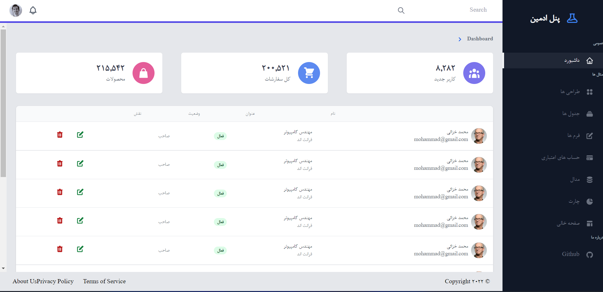

# persian panel
persian-panel create with vuejs


# fast explain
Dashboard starter template built Vue 3, Tailwind CSS and TypeScript. we try to develope our project this is a start



## Usage

```bash
# Install dependencies
$ npm install

# Compiles and hot-reloads for development
$ npm run serve

# Compiles and minifies for production
$ npm run build
```
