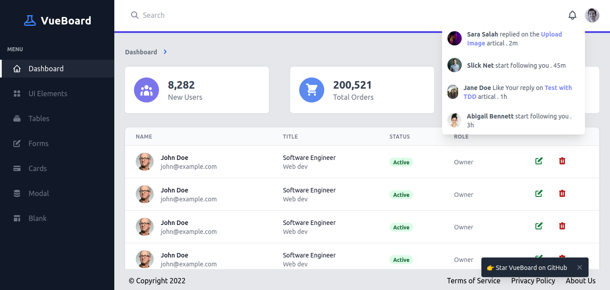
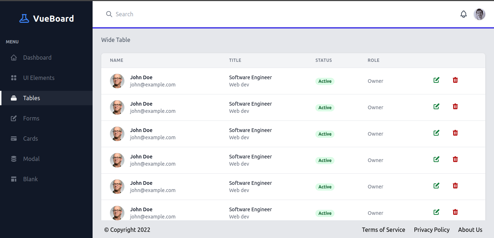

# VueBoard

Dashboard starter template built Vue 3, Tailwind CSS and TypeScript.




## Usage

```bash
# Install dependencies
$ npm install

# Compiles and hot-reloads for development
$ npm run serve

# Compiles and minifies for production
$ npm run build
```
